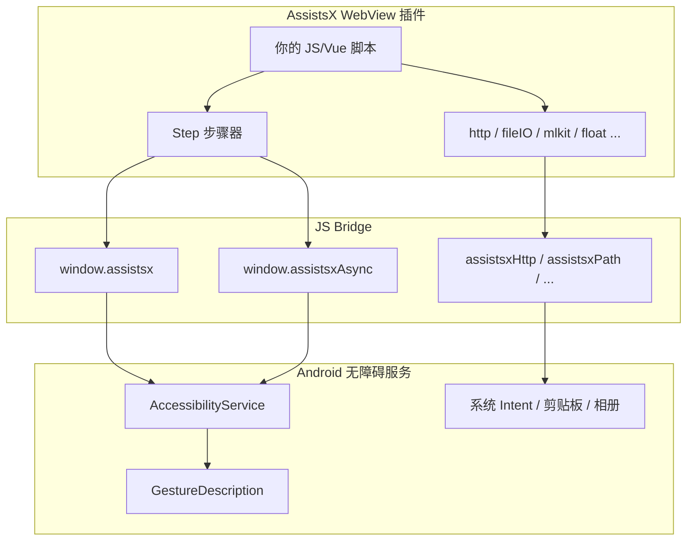
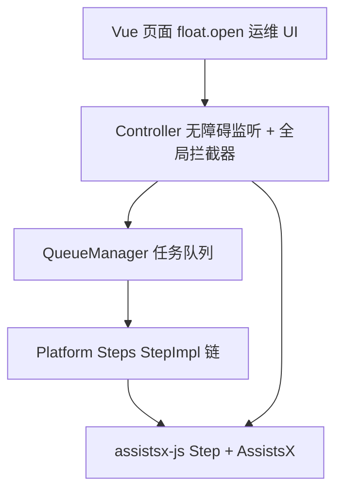

# 架构总览与术语表

## 库定位

**assistsx-js** 是在 Android 端 [AssistsX](https://www.pgyer.com/assistsx) WebView 插件内运行的 JavaScript SDK。它通过 JS Bridge 调用 Android 无障碍服务（AccessibilityService），实现：

- 界面节点查找与操作
- 手势模拟（点击、滑动、长按）
- 系统级操作（返回、Home、启动 App）
- 截图、OCR、HTTP、文件、相册等扩展能力
- **Step 步骤器** 组织复杂自动化流程

脚本以 Web 插件形式加载（HTML/Vue），在 AssistsX 的 WebView 中执行，**不能**在普通浏览器或 Node.js 中独立运行。

## 架构图



## 三层 API 模型

| 层级 | 入口 | 职责 |
|------|------|------|
| **全局层** | `AssistsX` / `AssistsXAsync` | 无步骤上下文的全局节点查找与操作 |
| **步骤层** | `Step` / `step.async` | 带 `stepId` 校验的步骤内操作，防中断后继续执行 |
| **节点层** | `Node` / `node.async` | 在单个节点子树内查找与操作 |

推荐用法：

- 简单按钮点击：`AssistsX.findById(...)[0].click()`
- 多步骤自动化：`Step.run(entryImpl)` + `step.next()` 链
- 步骤内异步操作：`step.async.findById()`（保留 stepId 绑定）

## 插件生命周期

1. **安装 AssistsX**：Android 设备安装并开启无障碍服务
2. **开发 Web 插件**：Vite/Vue 项目 + `assistsx_plugin_config.json`
3. **局域网加载**：`npm run dev`，AssistsX 扫描局域网添加插件
4. **运行脚本**：点击「开始」，WebView 加载你的页面，JS 调用 Bridge
5. **调试**：浮层 UI（`float.open`）、日志（`log` 模块）、节点树导出

## 术语表

| 术语 | 说明 |
|------|------|
| **Node** | Android `AccessibilityNodeInfo` 的 JS 映射，含 `viewId`、`text`、`className`、`bounds` 等 |
| **viewId** | Android 资源 ID，如 `com.tencent.mm:id/jha` |
| **StepImpl** | `(step: Step) => Promise<Step \| undefined>`，单步实现函数 |
| **stepId** | 每次 `Step.run` 生成的 UUID，用于 `Step.assert` 防 stop 后继续操作 |
| **scope** | 节点查找范围：`active_window`（当前窗口）或 `all_windows`（所有窗口） |
| **Bridge** | `window.assistsx.call(JSON)` 同步调用原生方法 |
| **CallResponse** | Bridge 返回封装，`code === 0` 表示成功 |
| **Interceptor** | Step 每步执行前的拦截器，用于处理系统弹窗 |

## 全局变量

```typescript
import { screen } from "assistsx-js";

console.log(screen.width, screen.height);
```

> `AssistsX.screenSize` 已废弃，请使用全局 `screen` 或 `AssistsX.getScreenSize()`。

## wx-auto 生产分层（参考）

大型项目通常采用分层架构：



详见 [task-queue-architecture.md](../04-patterns/task-queue-architecture.md)。

## 扩展阅读

- [project-setup.md](./project-setup.md) — 项目搭建
- [sync-vs-async.md](./sync-vs-async.md) — 同步/异步选型
- [bridge-and-call-response.md](../01-core/bridge-and-call-response.md) — Bridge 机制
- [utils-and-bridge-reference.md](../01-core/utils-and-bridge-reference.md) — 桥接与过滤器
