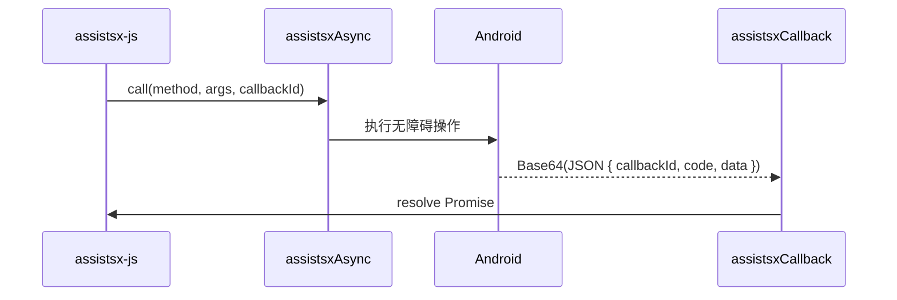

# JS Bridge 与 CallResponse

## Bridge 机制

assistsx-js 在 AssistsX WebView 中通过 `window` 上的桥接对象与 Android 原生通信：

| 桥接对象 | 用途 |
|----------|------|
| `window.assistsx` | 同步调用 |
| `window.assistsxAsync` | 异步调用（callbackId + `window.assistsxCallback`） |
| `window.assistsxHttp` | HTTP 模块 |
| `window.assistsxPath` / `assistsxFileIO` / `assistsxFileUtils` | 文件系统 |
| `window.assistsxIme` / `assistsxImageUtils` / `assistsxGallery` / `assistsxMlkit` | 扩展能力 |
| `window.assistsxFloat` / `assistsxBarUtils` / `assistsxLog` | UI 与日志 |

库加载时自动注册 `window.assistsxCallback`，用于异步结果回传（Base64 解码 + JSON 解析）。

## 底层 call

一般不需要直接调用，调试时可了解：

```typescript
import { AssistsX, CallResponse } from "assistsx-js";

// 同步
const response: CallResponse = AssistsX.call("findById", {
  args: { id: "com.example:id/btn" },
});
if (response.isSuccess()) {
  const nodes = response.getDataOrDefault([]);
}

// 异步
const asyncResponse = await AssistsX.asyncCall("getPackageName", { args: {} }, 5000);
```

## CallResponse

```typescript
class CallResponse {
  code: number;        // 0 = 成功
  data: any | null;
  callbackId: string | null;

  isSuccess(): boolean;
  getData(): any;                    // data 为 null 时抛错
  getDataOrNull(): any | null;
  getDataOrDefault(defaultValue): any;
}
```

### 使用模式

```typescript
const response = AssistsX.findById("com.example:id/x"); // 内部封装 call

// 库内封装通常直接返回业务类型，如 Node[]
// 若直接拿到 CallResponse：
if (!response.isSuccess()) {
  console.warn("call failed", response.code);
  return;
}
const data = response.getDataOrDefault([]);
```

## 异步 callback 流程



## timeout

`AssistsXAsync.*` 多数方法最后一个参数为 `timeout`（毫秒）。超时后 Promise 可能 resolve 失败响应或空数据，业务层应判断返回值：

```typescript
const pkg = await AssistsXAsync.getPackageName(3000);
if (!pkg) {
  // 超时或失败
}
```

## CallMethod 常量

`CallMethod` 导出全部原生方法名字符串（77+），供高级场景或日志对齐：

```typescript
import { CallMethod } from "assistsx-js";
// CallMethod.FIND_BY_ID, CallMethod.CLICK_BY_GESTURE, ...
```

## 环境检测

在普通浏览器中 `window.assistsx` 不存在，调用会失败。插件内 AssistsX 注入 Bridge 后可用。

```typescript
if (typeof window !== "undefined" && window.assistsx) {
  // 在 AssistsX 环境内
}
```

## 常见坑

| 问题 | 原因 | 解决 |
|------|------|------|
| `assistsx is undefined` | 非 WebView 环境 | 在 AssistsX 插件内运行 |
| 异步无回调 | callback 被提前删除 | 避免同一 callbackId 重复注册 |
| code !== 0 | 权限、节点无效 | 检查无障碍、viewId、界面状态 |

## 扩展阅读

- [assistsx-api.md](./assistsx-api.md)
- [assistsx-async-api.md](./assistsx-async-api.md)
- [troubleshooting.md](../06-appendix/troubleshooting.md)
