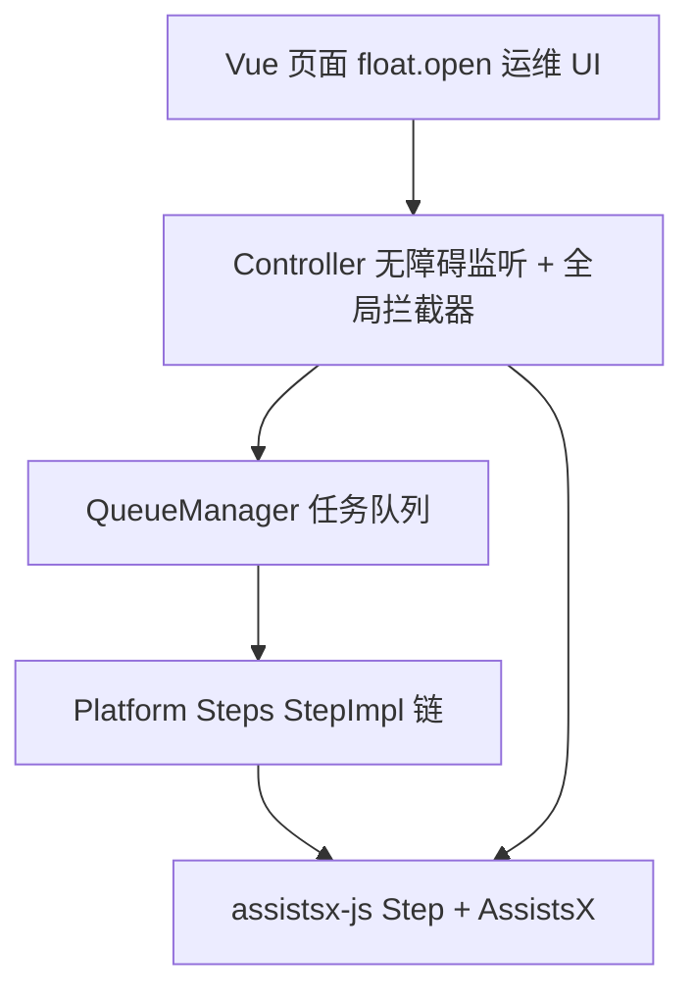

# 任务队列生产架构

wx-auto 级别的自动化项目推荐 **Controller + QueueManager + Platform Steps** 三层结构。

## 架构图



## 各层职责

| 层 | 职责 |
|----|------|
| **Vue UI** | 启动/停止、浮层日志、配置 |
| **Controller** | 无障碍监听、Step 拦截器、TaskStatus、Step.stop 协调 |
| **QueueManager** | 任务队列、顺序/插队执行、测试模式终止 |
| **Platform Steps** | 各 App 的 StepImpl 链 |

## QueueItem 结构（wx-auto 模式）

```typescript
interface QueueItem {
  type: QueueItemType;  // 枚举：养号、拓客、未读、AI、冷却…
  name: string;
  step: StepImpl;
  data?: StepData;
  priority?: number;
}
```

常见 `QueueItemType`：`CheckWxUnread`、`FbAccountNurturing`、`FbCustomerAcquisition`、`AiTask`、`CoolDownTask`、`LaunchIntelligentManagement`、`LinkedAccountWeixin` 等。

## QueueManager 核心逻辑

```typescript
class QueueManager {
  queue: QueueItem[] = [];

  addToQueue(item: QueueItem, toFront = false) {
    if (toFront) this.queue.unshift(item);
    else this.queue.push(item);
  }

  clearQueue() {
    this.queue = [];
  }

  async executeAllInQueue() {
    const stepStore = useStepStore();
    while (this.queue.length > 0) {
      const item = this.queue[0]; // 不移除，失败可重试或跳过策略自定
      Step.stop(); // 新任务前停止旧 Step
      try {
        await Step.run(item.step, { data: item.data, tag: item.type });
        this.queue.shift();
      } catch (e) {
        if (e instanceof StepPauseError) {
          this.queue.shift();
          continue;
        }
        if (stepStore.status === "error" && isTestModeStopOnError) {
          this.clearQueue();
          break;
        }
        this.queue.shift();
        logTaskFailure(item, e);
      }
    }
  }
}
```

## Controller 与任务启动

```typescript
// 智能托管：监听 + 拦截器 + 初始未读检查入队
async function launchIntelligentManagement() {
  controller.listener({ enableWeixin: true, enableWhatsapp: true });
  controller.setStepInterceptor();
  queueManager.addToQueue({ type: "CHECK_WX_UNREAD", step: wxCheckUnread });
  queueManager.addToQueue({ type: "CHECK_WS_UNREAD", step: wsLaunch });
  await queueManager.executeAllInQueue();
}

// Facebook 拓客
async function facebookCustomerAcquisition() {
  Step.stop();
  controller.setStepInterceptor();
  await Step.run(facebookEnter.launch, {
    data: { customerAcquisition: true, packageName: "com.facebook.katana" },
  });
}
```

## 冷却任务

```typescript
const coolDown: StepImpl = async (step) => {
  step.home();
  await step.delay(1000);
  return step.repeat();
};

// 外部定时 throw StepError("cooldown finished") 或 Step.stop 打断
```

## TaskStatus 状态机（概念）

Controller 维护 `currentTaskStatus`（Idle、Listening、ExecutingFbAccountNurturing、CheckingWxUnread…），用于：

- 无障碍 listener 是否插队
- 浮层 UI 展示
- 任务结果上报

## useStepStore 测试模式

```typescript
const store = useStepStore();
if (store.status === "error" && isTestMode && !isNurturingTimeout) {
  queueManager.clearQueue();
}
```

## 浮层运维 UI

```typescript
await float.open("/#/logs", { initialWidth: 800, initialHeight: 300 });
await controller.run(true);
```

## 常见坑

| 问题 | 处理 |
|------|------|
| 任务互相打断 | 每步前 `Step.stop()` |
| 插队顺序错 | 未读用 `unshift` 或高 priority |
| PauseError 当失败 | 单独 catch |
| 拦截器未开 | 长任务前 `setStepInterceptor()` |

## 扩展阅读

- [accessibility-events.md](./accessibility-events.md)
- [step-interceptors-and-errors.md](../02-step-engine/step-interceptors-and-errors.md)
- [platform-index.md](../05-platform-recipes/platform-index.md)
