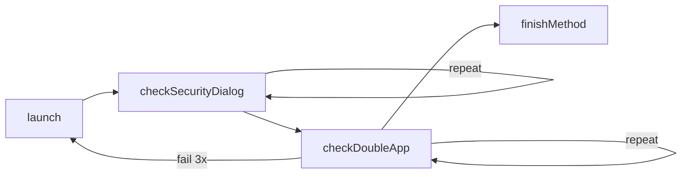

# 应用启动与权限处理

通用 **AppEnter** 模板：安装检查 → launch → 安全中心 → 双开选择 → 业务 `finishMethod`。

## 流程图



## 完整模板（脱敏）

```typescript
import { AssistsX, Step, StepError, StepImpl } from "assistsx-js";

class AppEnter {
  appName = "";
  packageName = "";

  launch: StepImpl = async (step) => {
    this.appName = step.data?.appName ?? "";
    this.packageName = step.data?.packageName ?? "";
    if (!this.packageName) throw new StepError("packageName required");
    if (!AssistsX.isAppInstalled(this.packageName)) {
      throw new StepError(`${this.appName} not installed`);
    }
    step.launchApp(this.packageName);
    return step.next(this.checkSecurityDialog);
  };

  checkSecurityDialog: StepImpl = async (step) => {
    if ((await step.async.getPackageName()) === this.packageName) {
      return step.data?.finishMethod
        ? step.next(step.data.finishMethod)
        : undefined;
    }
    const miui = (await step.async.findById(
      "com.miui.securitycenter:id/buttonPanel"
    ))[0];
    if (miui) {
      const allow = (await miui.async.findById("android:id/button1"))[0];
      if (allow) await allow.async.click();
      return step.next(this.checkDoubleApp);
    }
    if (step.repeatCount >= 2) return step.next(this.checkDoubleApp);
    return step.repeat();
  };

  checkDoubleApp: StepImpl = async (step) => {
    if ((await step.async.getPackageName()) === this.packageName) {
      return step.data?.finishMethod
        ? step.next(step.data.finishMethod)
        : undefined;
    }
    const handled = await this.handleDualAppDialog(step);
    if (handled) return undefined;
    if (step.repeatCount > 5) {
      step.data.launchRepeatCount = (step.data.launchRepeatCount ?? 0) + 1;
      if (step.data.launchRepeatCount >= 3) return undefined;
      return step.next(this.launch);
    }
    return step.repeat();
  };

  handleDualAppDialog: StepImpl = async (step) => {
    const useClone = step.data?.useCloneApp === true;

    // 小米 MIUI 双开
    let app1 = (await step.async.findById("com.miui.securitycore:id/app1"))[0];
    let app2 = (await step.async.findById("com.miui.securitycore:id/app2"))[0];
    if (app1 && app2) {
      await (useClone ? app2 : app1).async.click();
      return true;
    }

    // ColorOS / 一加 Android 15 intent resolver
    app1 = (await step.async.findById(
      "com.android.intentresolver:id/resolver_item_layout"
    ))[0];
    app2 = (await step.async.findById(
      "com.android.intentresolver:id/resolver_item_layout"
    ))[1];
    if (app1 && app2) {
      await (useClone ? app2 : app1).async.click();
      return true;
    }

    // OPPO Android 10
    app1 = (await step.async.findById("oppo:id/resolver_item_name"))[0];
    app2 = (await step.async.findById("oppo:id/resolver_item_name"))[1];
    if (app1 && app2) {
      const target = useClone ? app2 : app1;
      const clickable = await target.async.findFirstParentClickable();
      await clickable.async.click();
      return true;
    }

    return false;
  };
}

export const appEnter = new AppEnter();
```

## finishMethod 衔接

```typescript
const myBusiness: StepImpl = async (step) => {
  return undefined;
};

await Step.run(appEnter.launch, {
  data: {
    appName: "Facebook",
    packageName: "com.facebook.katana",
    finishMethod: myBusiness,
    useCloneApp: false,
  },
});
```

同一 `AppEnter` 类可被多平台 `*Enter.launch` 复用，仅 `packageName` / `finishMethod` 不同。

## 全局拦截器

权限弹窗也可由 `Step.addInterceptor` 统一处理（Android 13 权限控制器、MIUI 安全中心、抖音/小红书弹窗等），与 AppEnter 互补。拦截器在 `repeatCount > 3` 后才点击，避免误触。

见 [step-interceptors-and-errors.md](../02-step-engine/step-interceptors-and-errors.md)。

## 常见坑

| 问题 | 处理 |
|------|------|
| launch 成功但 pkg 仍不对 | 双开弹窗未点，补 handleDualAppDialog |
| 小米允许后仍失败 | 安全中心与 permissioncontroller 是两步 |
| 克隆/主应用选错 | `step.data.useCloneApp` 与业务账号类型一致 |
| 无限 repeat | `launchRepeatCount` + `repeatCountMax` 双计数退出 |

## 扩展阅读

- [step-basics.md](../02-step-engine/step-basics.md)
- [waiting-and-retry.md](../04-patterns/waiting-and-retry.md)
- [platform-index.md](./platform-index.md)
